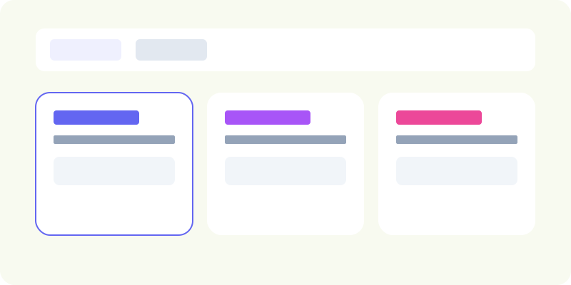

# Task Management System



Este es un sistema de gestión de proyectos y tareas construido con React, Node.js y PostgreSQL, orquestado con Docker.

## Características
- **Dashboard**: Visualización de proyectos y sus tareas con un diseño moderno y colorido.
- **Admin**: CRUD completo de proyectos (protegido por autenticación).
- **Backend**: API REST con arquitectura basada en servicios y fachadas.
- **Seguridad**: Autenticación JWT y hashing de contraseñas con bcrypt.

## Requisitos
- Docker
- Docker Compose

## Cómo subir el proyecto (Docker)

Para construir y levantar todos los servicios (Base de Datos, Backend y Frontend), ejecuta el siguiente comando en la raíz del proyecto:

```bash
docker-compose up --build
```

### Acceso a las aplicaciones
- **Frontend**: [http://localhost:3000](http://localhost:3000)
- **Backend API**: [http://localhost:4000/api](http://localhost:4000/api)
- **API Documentation (Swagger)**: [http://localhost:4000/api-docs](http://localhost:4000/api-docs)

### Credenciales por defecto (Admin)
- **Usuario**: `admin`
- **Contraseña**: `gopass2026`

## Arquitectura y Principios de Diseño

### SOLID Principles
El proyecto aplica los principios SOLID para asegurar un código mantenible y escalable:
- **S (Single Responsibility)**: Cada componente tiene una responsabilidad única. Los controladores gestionan el flujo HTTP, los validadores aseguran la integridad de los datos, y los modelos definen la estructura de datos.
- **O (Open/Closed)**: El sistema está diseñado para ser extendido (ej. agregando nuevos modelos o rutas) sin necesidad de modificar la lógica central de autenticación o base de datos.
- **L (Liskov Substitution)**: Se utilizan interfaces y contratos claros (como los modelos de Sequelize) que permiten interactuar con las entidades de manera predecible.
- **I (Interface Segregation)**: La modularidad del sistema permite que cada parte (frontend, backend, db) funcione de manera independiente y solo consuma lo que necesita.
- **D (Dependency Inversion)**: Se utiliza inversión de dependencias a través de variables de entorno y la configuración centralizada de Sequelize, desacoplando el código de la infraestructura específica.

### Design Patterns: Facade Pattern
Se ha implementado el patrón **Facade (Fachada)** en el backend para simplificar la interacción entre los controladores y la capa de datos (Sequelize).
- **Cómo se usó**: Se crearon clases `ProjectFacade` y `TaskFacade` en `backend/facades/`. Estas clases encapsulan la complejidad de las consultas de Sequelize (filtros, inclusions, etc.).
- **Beneficio**: Los controladores ahora son "delgados" y no necesitan conocer los detalles internos del ORM, facilitando las pruebas unitarias y permitiendo cambiar la lógica de persistencia en un solo lugar sin afectar la capa de transporte (API).

## Otros comandos útiles

### Reiniciar Base de Datos y Seeders (Script)
Para limpiar completamente la base de datos y volver a ejecutar los seeders, puedes usar el script incluido:
```bash
./reset-db.sh
```

### Detener los contenedores
```bash
docker-compose down
```

### Ver logs del backend
```bash
docker logs -f gopass_backend
```

### Reiniciar la base de datos (limpiar datos)
```bash
docker-compose down -v
docker-compose up --build
```

## Estructura del Proyecto
- `backend/`: API de Node.js (Express, Sequelize, JWT).
- `frontend/`: Aplicación React (Vite, Axios, CSS Modules).
- `docker-compose.yml`: Orquestación de contenedores.
enedores.
